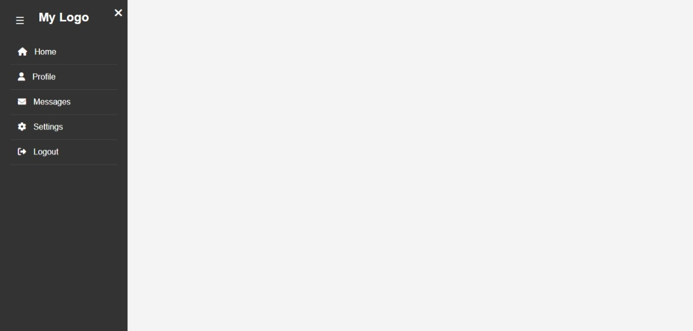

# Collapsible Sidebar – Elevvo Internship Task 1

This is a responsive collapsible sidebar built from scratch using *HTML, **CSS, and **JavaScript, developed as part of my internship with **Elevvo*.

##  Features

- Fully collapsible sidebar
- Toggle button (☰) to open
- Close button (✖) inside the sidebar
- Responsive design (works on mobile, tablet, desktop)
- FontAwesome icons for nav items
- Smooth slide-in/slide-out animation
- Clean and organized folder structure

##  Tech Stack  

- HTML
- CSS
- JavaScript
- FontAwesome (via CDN)

👉 [View Live Site](https://muhammad-salman123.github.io/Sidebar-elevvo-task/)

##  Screenshots

  

